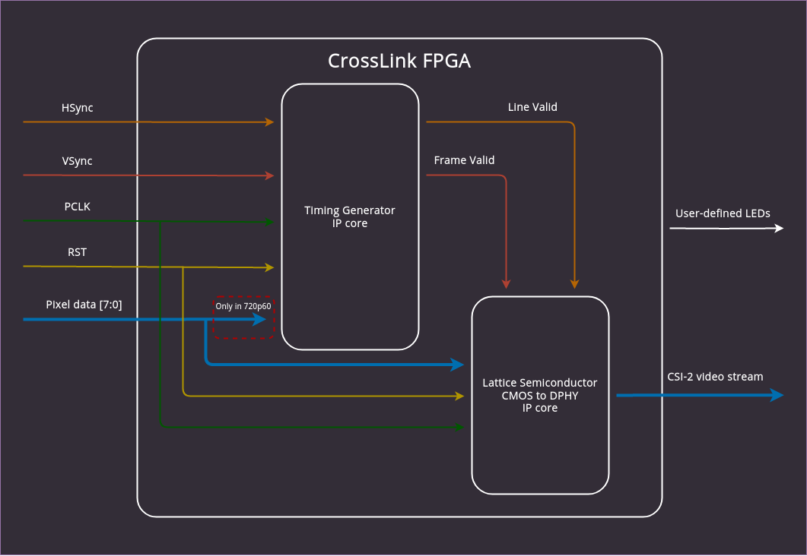

# Building the FPGA design

The CrossLink FPGA is responsible for converting data deserialized from SDI by the Semtech chip to MIPI CSI-2.
The FPGA design consists of 2 main parts:

* [Lattice CMOS to D-PHY IP](https://www.latticesemi.com/en/Products/DesignSoftwareAndIP/IntellectualProperty/IPCore/IPCores04/CMOStoMIPICSI2InterfaceBridge) - converts standard parallel video data into CSI-2 byte packets.
* [Timing Generator IP](https://github.com/antmicro/sdi-mipi-bridge-fpga-design/blob/main/src/sdi2mipi.py) - generates correct timings for the MIPI CSI-2 transmitter from synchronization signals acquired from the SDI deserializer.

:::{figure-md}


Lattice Crosslink FPGA Design
:::

## Timing Generator

The timing generator block converts synchronization signals from the deserializer (`hsync`, `vsync`) into Line Valid (`lv`) and Frame Valid (`fv`) signals, which are required by the CMOS to D-PHY IP core for producing a MIPI CSI-2 video stream.
The clock output signal from the deserializer is used as a pixel clock (`pclk`) during the conversion.
The configuration of the generator is specific to the chosen video format.
A list of supported video formats available in the {doc}`Timing Generator section <timing_gen>` of this documentation.

## CMOS to MIPI D-PHY

The Lattice CMOS to D-PHY IP core provides a bridging solution for converting parallelized pixel data from the deserializer into a MIPI CSI-2 video stream.
The configuration of the IP core depends on the selected resolution and framerate.
Therefore a different bistream needs to be used for each of the supported video formats. An appropriate bitstream needs to be loaded into the FPGA after each resolution change.

## Setting up the environment

The design in [the FPGA design repository](https://github.com/antmicro/sdi-mipi-bridge-fpga-design) requires the Lattice Diamond tool for generating the bitstream.
For instructions on installing and using Diamond, please refer to the [Lattice Diamond 3.12 Installation Guide for Linux](https://www.latticesemi.com/view_document?document_id=53082).

Additionally, make sure that you have the sources of the CMOS to D-PHY 1.3 IP-Core installed using Diamond Clarity Designer.
For more information, check the _Accomplishing Tasks with Clarity Designer_ section from [Clarity Designer User Manual](https://www.latticesemi.com/view_document?document_id=52649) (p. 11).

Once you have Diamond set up, install the Python prerequisites:

```bash
pip3 install -r requirements.txt
```

## Building the bitstream

After you've prepared your environment, you can build the project with a `make`-based build flow by running:

```bash
make <video-format>-<lanes>
```

The output files will be generated in the `build/<video-format>-<lanes>` directory.

For example, to produce a bitstream for the 1280x720@60Hz resolution with a 2-lane data bus, execute:

```bash
make 720p60-2lanes
```

The build files will be located in the `build/720p-2lanes` directory.


## Testing

If you want to test the SDI2MIPI Core in simulation, you can run the `pytest` tests:

```bash
make test
```

Example output:

```
$ make test
PYTHONPATH=/builds/sdi-mipi-bridge-fpga-design cd tests && pytest
============================= test session starts ==============================
platform linux -- Python 3.9.2, pytest-7.2.1, pluggy-1.0.0
rootdir: /builds/sdi-mipi-bridge-fpga-design/tests
collected 11 items

test_sim.py ...........                                                  [100%]

======================== 11 passed in 531.68s (0:08:51) ========================
```
