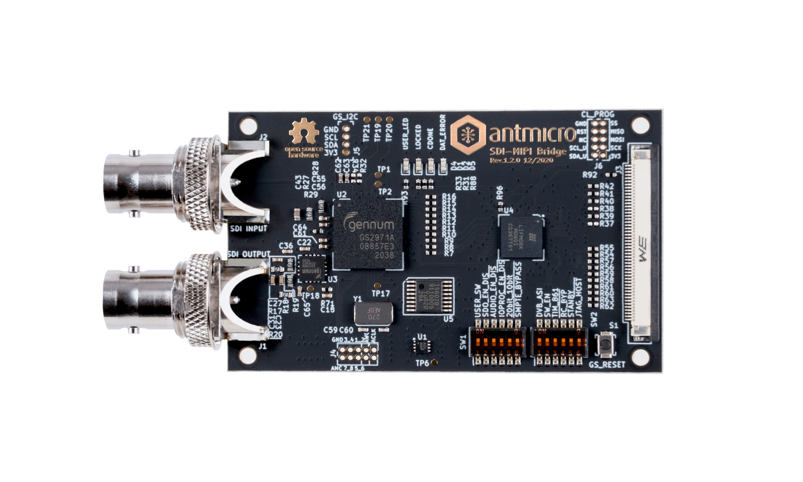
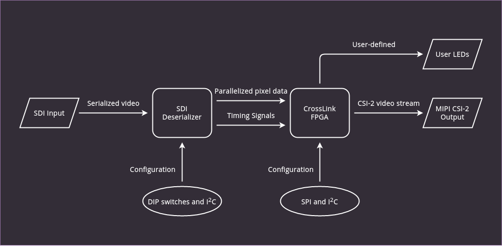
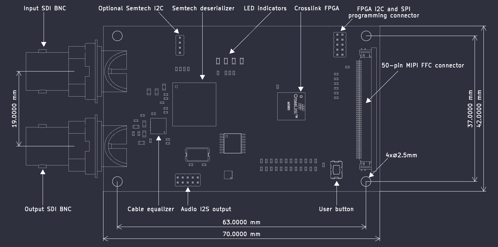

# Hardware setup

A complete setup using the SDI-MIPI Bridge would typically consist of at least 3 devices:

- {ref}`bridge` - Antmicro's [SDI to MIPI CSI-2 Bridge](https://github.com/antmicro/sdi-mipi-bridge) responsible for deserializing SDI data and packeting it with the MIPI CSI-2 protocol,
- {ref}`transmitter` - a device transmitting SDI video data, connected to the SDI input port of the bridge,
- {ref}`receiver` - a device receiving MIPI CSI-2 video data, connected to the MIPI CSI-2 output port of the bridge.

(bridge)=
## SDI Bridge

The core part of the setup is the SDI to MIPI CSI-2 Bridge that you can obtain from Antmicro's partner [Capable Robot Components](https://capablerobot.com/products/sdi-mipi-bridge/).
You can also design and manufacture custom variants and integrated hardware through Antmicro's engineering services - please refer to the {ref}`services` section to learn more.

:::{figure-md}


SDI to MIPI CSI-2 Bridge, rev. 1.2.0
:::

### Key features

* Operates at 2.97Gb/s, 2.97/1.001Gb/s, 1.485Gb/s, 1.485/1.001Gb/s and 270Mb/s
* Supports SMPTE ST 425 (Level A and Level B), SMPTE ST 424, SMPTE ST 292, SMPTE ST 259-C and DVB-ASI
* Integrated SDI adaptive cable equalizer and output loopback connector
* I{sup}`2`S de-embedded audio output for up to 8 channels at 48kHz exposed on a 10-pin header
* Two 4-lane MIPI D-PHY transceivers at 6 Gbps per PHY exposed on a 50 pin FFC connector
* I{sup}`2`C programming and communication interface for the CrossLink FPGA and Semtech SDI deserializer
* SPI interface for programming the CrossLink FPGA
* 12 DIP switches for the Semtech SDI deserializer configuration pins
* 2 LED indicators for user purposes

### Architecture and operation

:::{figure-md}


SDI to MIPI CSI-2 Bridge architecture
:::

For video data, the board has an SDI input BNC connector and a MIPI CSI-2 output 50-pin connector, as well as an additional SDI loopback BNC connector.

SDI signal conversion is implemented with the Semtech GS2971A deserializer which passes the parallel 10-bit data to the Lattice CrossLink FPGA.
The CrossLink FPGA family targets video bridging and processing applications, with hard MIPI D-PHY interfaces. In this application, it is used to convert parallel data to the MIPI CSI-2 format.

There is also a 10-pin connector on the board which provides audio data extracted from the SDI stream in I{sup}`2`S format.
Additionally, the board exposes SPI and I{sup}`2`C interfaces.

#### SDI deserializer configuration

Due to the board's wide range of capabilities and possible support for various different configurations there are 12 DIP-switches for configuring the SDI deserializer.
A detailed description of their functions is available in the [Semtech GS2971A documentation](https://semtech.my.salesforce.com/sfc/p/#E0000000JelG/a/44000000MD3i/kpmMkrmUWgHlbCOwdLzVohMm1SDPoVH85guEGK.KXTc).

Below you can find a short description of each switch with its default setting which should be set in order to make the board work with the software/bitstream setup provided by Antmicro:

```{csv-table}
:file: switches.csv
:header-rows: 1
:widths: 18,10,62
```

### Board dimensions

:::{figure-md}


SDI Bridge dimensions
:::

(transmitter)=
## Transmitter

The transmitter is a device (typically a camera) outputting data via the SDI interface.
It must be compatible with one of the 5 available formats:

- 720p25Hz YUV422,
- 720p30Hz YUV422,
- 720p50Hz YUV422,
- 720p60Hz YUV422,
- 1080p25Hz YUV422,
- 1080p30Hz YUV422,
- 1080p50Hz YUV422,
- 1080p60Hz YUV422.

Several input devices were tested with the SDI to MIPI Bridge, e.g.:

- Atomos Shogun Flame,
- [Blackmagic HDMI to SDI Converter](https://www.blackmagicdesign.com/products/microconverters),
- [Decimator HDMI/SDI 4K Cross Converter](http://decimator.com/Products/MiniConverters/12G-CROSS/12G-CROSS.html).

(receiver)=
## Receiver

The receiver is a device capable of receiving data through the MIPI CSI-2 interface.
The [Software section](software.md) of this documentation covers support for 3 boards:

* Jetson Xavier NX
* Jetson TX2
* Raspberry Pi CM4

Antmicro provides [sources](https://github.com/antmicro/sdi-mipi-bridge-linux) for a Linux distribution configured for SDI Bridge support for these boards.
If you need help with making the board work with other edge AI platforms or integrating the SDI interface into your own dedicated device, Antmicro offers {ref}`services`.
