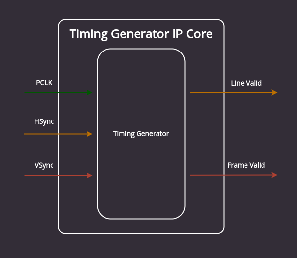
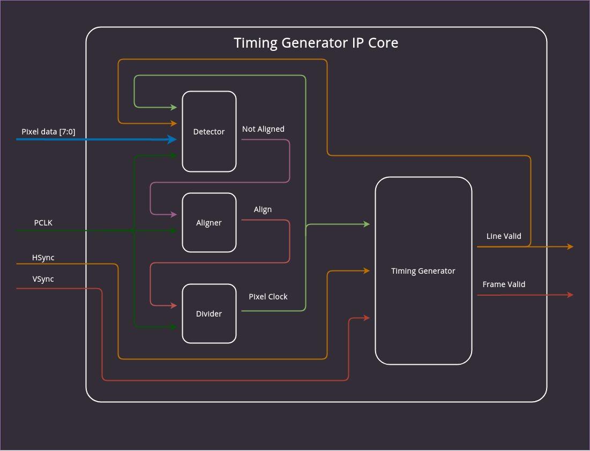

# Operation of the Timing Generator

The timing generator block converts synchronization signals from the deserializer (`hsync`, `vsync`) into Line Valid (`lv`) and Frame Valid (`fv`) signals, which are required by the CMOS to D-PHY IP core for producing a CSI-2 video stream.
Besides the synchronization signals, the pixel clock and pixel data provided by the deserializer are passed down to the CMOS to DPHY IP core. 

## Multiple variant support

Since the [Lattice CMOS to D-PHY IP Core](https://www.latticesemi.com/en/Products/DesignSoftwareAndIP/IntellectualProperty/IPCore/IPCores04/CMOStoMIPICSI2InterfaceBridge) can not be dynamically reconfigured for different resolutions the video parameters need to be specified at build time.
The table below summarizes the parameters used for the supported resolutions:

```{csv-table}
:file: cmos2dphy_params.csv
:header-rows: 1
```

Video formats **1080p25fps** and **1080p50fps** operate on the same module parameters as **1080p30fps** and **1080p60fps** respectively.

## 1920x1080 variants

The timing generator for 1080p consists of a single module whose only function is to convert the video timing signals coming from the deserializer into Line Valid (`lv`) and Frame Valid (`fv`) signals.

:::{figure-md}


SDI Bridge timing generator diagram for 1080p resolution
:::

## 1280x720 variants

The generator for 720p requires some additional logic due to an issue causing a random video output color flip (luminance and chrominance swap).
The problem is related to a different pixel data alingment in supported input stream variants.
In order to overcome this issue, two additional blocks were introduced:

* The Detector - Scans pixel data in search for a known data pattern SAV (*Start of Active Video*) and compares the retrieved bytes with the clock state at each given moment.
When consecutive SAV bytes are not properly aligned, the detector module outputs a signal that drives the align input of the divider module. The divider module shifts the output clock phase until the pixel data is aligned to it.

* The Divider - Used for generating the correct Pixel Clock frequency.
The Deserializer outputs a 148.5 MHz clock which is too fast for the 720p resolution.
Hence the frequency of the input clock is lowered to 74.25 MHz by routing it through the `CLKDIVG` module which divides the frequency by 2.

:::{figure-md}


SDI Bridge timing generator diagram for 720p resolution
:::
